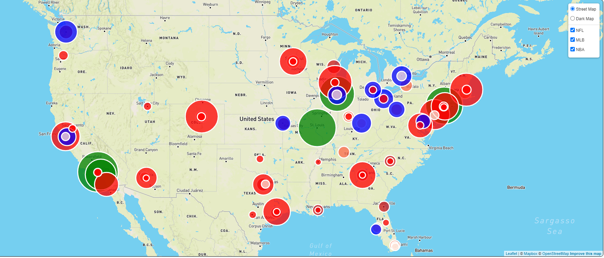
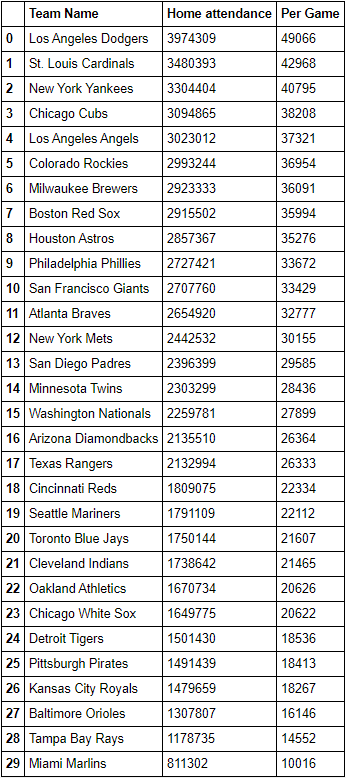
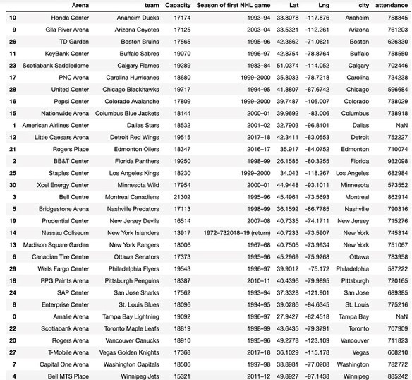
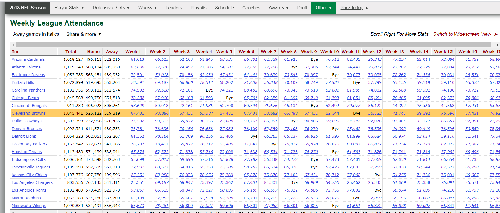
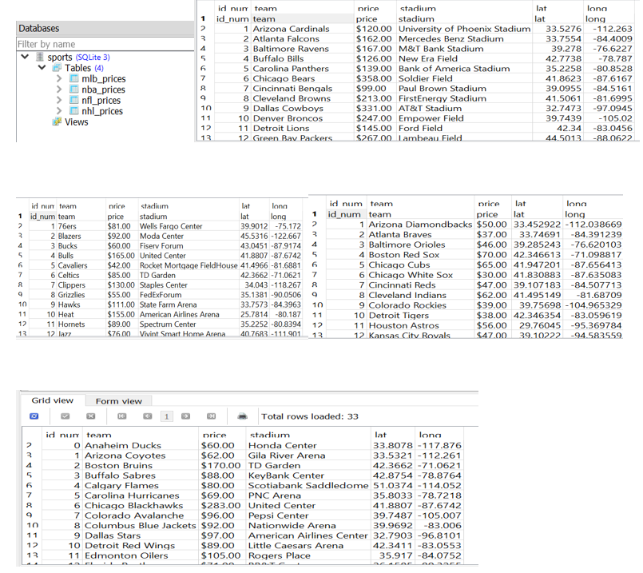

# Sports Popularity

# **Summary of Interests and Intent**

Major league sports are an integral part of many American lives. However, not all sports are equally popular in all cities. For example, the Green Bay Packers are a wildly successful football team in Wisconsin, but Wisconsin has no NHL team and no corresponding popularity of major league hockey. We are interested in analyzing the relative popularity of each of the “Big 4” sports, (hockey, baseball, football, and basketball) in major American cities and unearthing patterns in where some sports are more or less popular than others. On this large scale, we will use seasonwide attendance to games as a metric to score relative popularity; and we will also compare average ticket prices for teams' games across the four sports. Due to the implications of the Coronavirus pandemic, our professional sport teams' season data will be accesd from the 2018 and 2019 seasons. It's important to note that some sports have seaons that span across two calendar years, such as the hockey, basketball and football seasons.

# **Data Sources**

Sports season-wide attendance data is relatively easily to find across the internet. To access this data, we will be using a series of web-scraping techniques, including but not limted to python's Pandas library and Beautiful Soup. 
For our baseball attendance data, we will be scraping the [Wikipedia article](https://en.wikipedia.org/wiki/2019_Major_League_Baseball_season) 2019 Major League Baseball Season to access data on the 2019 Major League Baseball season, as well as a [JSON of ballparks' locations](https://tinyurl.com/y3sby4ur) to accurately place the ballparks on our leaflet map. 
For the hockey attendance data we will be referencing ESPN's aggregate of the [2018-2019 hockey season](http://www.espn.com/nhl/attendance/_/year/2019), and the [Wikipedia list](https://en.wikipedia.org/wiki/List_of_National_Hockey_League_arenas) of all professional hockey arenas.
For the football attendance data we scraped Pro-Football-Reference's [data](https://www.pro-football-reference.com/years/2018/attendance.htm) on the 2018-2019 football season, and a [list](https://www.stadiumsofprofootball.com/comparisons/) of every professional football stadium.
For the basketball attendance data we accessed [ESNP's data](http://www.espn.com/nba/attendance/_/year/2019) for the 2018-2019 season, as well as the [Wikipedia list](https://en.wikipedia.org/wiki/List_of_National_Basketball_Association_arenas) of the professional basketball arenas.
For the ticket price data we utilzed the data from several sources and aggregated them into a single csv. The [MLB](https://www.tickpick.com/blog/how-much-are-mlb-tickets/) and [NFL](https://www.tickpick.com/blog/how-much-are-nfl-tickets/) ticket price data came from TickPick Blog. The [NBA's](https://finance.yahoo.com/news/average-ticket-prices-nba-team-100000563.html) ticket price data came from a Yahoo Finance article, and the [NHL's](https://www.vividseats.com/blog/nhl-team-rankings-by-median-ticket-price) ticket price data came from a VividSeats blog post.
## Baseball Attendance

Using the [Wikipedia article](https://en.wikipedia.org/wiki/2019_Major_League_Baseball_season) and the [JSON of ballparks' locations](https://tinyurl.com/y3sby4ur) we were able to collect the attendance data for MLB teams and place the ballpark locations on a map later on. In analzying the data, there are some interesting trends to note. In a way, the MLB attenddance data acts almost as a low-granularity population heatmap of the nation; the highest attended teams are centralized in the mid-atlantic through southern new england; southern California, and in the eastern mid-west. With the exception of the Rockies in Denver, Colorado and the Cardinals in Phoenix, Arizona, there is lack of MLB teams in the mountain-west region of the United States; especially when compared to the density of teams in other regions of the nation
## Hockey Attendance

## Football Attendance

## Basketball Attendance

## Ticket Prices

## Data Visualization

Once we extracted the data from our chosen sources and stored the data in an SQL database, we loaded it onto a flask app to create a restful API so the data can be easily recalled for further analysis. Using the javascript library leaflet, we requested the data from our flask API to overlay our data on a map of the United States. Once the flask app was fuctinoal, we [deployed our data and visualization](https://gfstuhr.github.io/SportsPopularityMerged/index.html) onto a static web-hosting service using a combination of Heroku and Github pages. We created selectable layers for each of the sports to display a heatmap of attendance. The radius and the color of the markers represent the relative seasonal attendance figures for each of the sports - the larger the radius, the higher the seasonal attendance for the team is. The color of each marker also represents the attendence data: for NBA and NFL teams, the color ranges from a light pink at the lower attended teams, to a dark red for higher attendance; for MLB teams, Clicking on each of the markers provides more data such as the team name and attendance figure associated with the marker. The user is able to select the specific sports' attendance figures they want to visualize, as well as switching betwen a "light" and "dark" view of the map depending on user preference.

# **Project Contributors** 

This is a collaborative project, shared between [Jennie Brozena](https://github.com/JenBroz), [Nathaniel Diamond](https://github.com/DiamondN97), [Faith Lierheimer](https://github.com/faithlierheimer), [Thambi Mathews](https://github.com/), and [Gabe Stuhr](https://github.com/gstuhr). 

ETL - take scraped data
Flask - make API to store data we grabbed
leaflet.js - requests data from flask and visualizes

<!-- Our primary dataset is the [B Corps Impact Data](https://data.world/blab/b-corp-impact-data/workspace/file?filename=B+Corp+Impact+Data.csv) available on Data.world. We used this dataset as a touchpoint and performed extended analysis using SEC filing data from [the last 10k API](https://dev.last10k.com/) as well as the [Yahoo Finance API](https://rapidapi.com/apidojo/api/yahoo-finance1?utm_source=google&utm_medium=cpc&utm_campaign=Alpha_102958294991&utm_term=yahoo%20finance%20api_e&gclid=Cj0KCQjwpZT5BRCdARIsAGEX0zlmHEzQ_judMHR3zkOQ10xpyYfHnxClxfrQJ6nX2cFcGNRWXliUBX0aAplXEALw_wcB) to analyze profit data. 

We also referenced the [B Analytics Standards Navigator](https://b-analytics.net/content/standards-navigator#:~:text=The%20B%20Impact%20Assessment%20is,measure%20and%20manage%20their%20impact.&text=Thus%2C%20the%20Standards%20Navigator%20is,%2C%20Supply%20Chain%20Managers%20etc.) to better understand the B Corp Impact Areas. 
# **Questions Asked**

### *What is the relative influence of each impact area on the overall impact score?* 
#### **Community Impact Area**: 
From the B-analytics standards navigator: The community impact area “evaluates the company’s positive impact on the external communities in which the company operates.” This includes things like diversity measures, economic impact, civic engagement, and supply chain impact. A scatterplot mapping the community impact area scores of all US B Corps in our dataset vs. the overall impact scores shows that variation in overall impact scores can be explained about 38% of the time by variation in community impact scores. In layman’s terms, the community impact area is responsible for about 38% of the overall score. 

#### **Environment Impact Area**:
From the B-analytics standards navigator: The environment impact area measures overall environmental stewardship of the company, asking questions in areas such as how the company identifies and manages general environmental impacts, specifically with things like air and climate issues, water sustainability, and impacts on land and life. A scatterplot mapping the environment impact area score vs the overall impact score shows that variation in overall impact scores can be explained about 15% of the time by variation in environment impact scores. In layman’s terms, the environment impact area is responsible for about 15% of the overall score.

#### **Customers Impact Area**: 
From the B-analytics standards navigator: The customers impact area evaluates the company’s value to their direct customers and consumers of their products and services, and asks questions like whether the company specifically benefits underserved populations, addresses social and/or economic problems, or helps create access to basic services. A scatterplot mapping the customers impact area score vs. the overall impact score shows that variation in overall impact score can be explained by variation in the customers impact score about 0.8% of the time. There’s not much of a linear relationship to be found here--which may speak partly to the relative importance of the customers impact area in assigning overall scores (low), or the fact that the dataset itself had many more NaNs that required filtering out than the other impact areas, which may have affected the regression.

#### **Governance Impact Area**: 
From the B-analytics standards navigator--the governance impact area evaluates the overall mission, ethics, accountability, and transparency of the company itself, asking questions that are largely centered around whether the company incorporates internal review of social and environmental performance principles, among other measures. A scatterplot mapping the governance impact area score vs the overall impact score shows that variation in overall impact scores can be explained by variation in the governance impact score about 22% of the time. In layman’s terms, the governance impact area is responsible for about 22% of the overall impact score. 

#### **Workers Impact Area**: 
From the B-analytics standards navigator: The Workers Impact Area evaluates a company’s contribution to financial, physical, professional, and social well-being, and asks questions primarily centered around whether most employees are full time, part time, or temporary, and whether their compensation is fixed, hourly, or daily, and weather the company is committed to hiring underemployed populations. A scatterplot mapping the workers impact area score vs. the overall impact score shows only a loose relationship between the two. An r squared value of 0.008 suggests that the variation in the workers impact area score only explains about 0.8% of the variation in the overall impact score. However, the workers impact area (like the customers impact area) also had more missing data (and NaN values) then the other impact areas, so the looser/lack of relationship here may be explained by the missing data.

#### **Correlation Data**: 
Calculating simple correlation coefficients between each impact area and the overall impact score will offer a similar insight to the linear regression graphs, but will provide a clearer insight into the correlation between each impact area and the overall score. Like the regression data, the correlation data tells us that the community impact area has the greatest influence on the overall score (i.e., is the most highly correlated), and the correlation coefficients largely match the r squared values from the individual linear regressions. 

*These data show that while all impact areas play a role in calculating the final impact score, the variance in overall impact scores in this dataset is best explained (and best correlated with) the community and customers impact areas, suggesting that companies looking to improve their impact scores may wish to prioritize improvement in their community and customers impact areas first.*

### *Does a company's impact score improve or worsen over the course of their tenure of certification?*

When considering the data as a whole, B Corps tend to increase their impact score from certification cycle to certification cycle. 

### *What industries (or sectors) tend to have higher impact scores?*
B-Certification Corporation has identified six major sectors. These are Services with Minor Environmental Footprint; Wholesale/Retail; Services with Significant Environmental Footprint; Manufacturing; Agriculture/Growers, and Service sectors. It’s interesting to note that there is a distinction between “service”, “service with minor environmental footprint” and “service with significant environmental footprint”. There are only seven companies labeled purely as operating in the “service” sector, while there are 1931 companies operating in the “service with minor environmental footprint” sector, and 259 companies operating in the “service with significant environmental footprint” sector. There are 696 companies operating in the “wholesale/retail” sector, 417 companies operating in the “manufacturing” sector, and 80 companies operating in the “agriculture/growers” sector.

The sector with the highest average impact score is “agriculture/growers” with an average impact score of 101.26. However, the maximum impact score for this sector is 148.5, which is the second lowest maximum impact score. The sector with the highest maximum impact score is “service with significant environmental footprint” with a maximum impact score of 184.0; the average impact score for this sector is 99.77, which is the second highest average impact score. The sector with the lowest maximum impact score and the lowest average is the “service” sector, with an average impact score of 90.53, and a maximum impact score of 107. 

A one-way ANOVA shows a significant difference in group averages (p = 0.001), and a post-hoc Tukey's Test shows that the differences lie between Wholesale/Retail and the two service groups that track environmental footprint. Wholesale/Retail is significantly lower than both service industry categories that track footprint. 

### *What industries tend to improve their impact score over multiple certification cycles? What industries tend to worsen their impact score over multiple certification cycles?*

This graph offers similar insight to the previous graph, but shows that while most sectors follow the overall trend of improving their impact score from cycle to cycle (with the exception of the Service sector, but this can be easily explained by a low sample size interfering with calculations), agriculture most dramatically increases their impact scores from cycle to cycle. 

### *Do publicly traded B Corps see an increase in profit as their impact score increases?*

Laureate Education is currently the only publicly traded B Corp, but still offers an interesting case study in whether increase in impact scores corresponds to an increase in profit. 

According to a more normative theory of business, a company’s main objective is to maximize profits, and indeed companies that are B-Certified also focus on revenue generation; a major tenet of B-Certification is to “use profits and growth as a means to a greater end”. We wanted to look at how the profits of a corporation change over the tenure of their certification and if there is any significant trend present. There is only one publicly traded company that is B-Certified: Laureate Education, which operates over 150 universities worldwide. They were first B-Certified in 2015, went public on the NYSE on January 31, 2017 and were re-certified on December 1, 2017 (which is reflected in the graph “Profits of Laureate Education (LAUR)” on the blue vertical line). While it’s hard to draw a conclusion based on a single case study, it is clear that as Laureate has continued in their tenure being Certified, their profits have significantly increased, until the first quarter of 2020, which also happens to be in the midst of the global COVID-19 pandemic. From this one example it is quite evident that Laureate was able to maintain their Certification while still readily growing and increasing their profits. It is important to note that their impact score did improve from their first certification in 2015 to their recertification in 2017.

##### B Corporations offer a consistent, rigorous framework from which companies can build or adjust their culture and practices to meet high standards of corporate social responsibility, a standard which allow a balance of profit and purpose. Most companies improve their overall impact score from year to year, showing that B Corp's rigorous standards are achievable and meet a growing demand for companies actively demonstrating and pursuing corporate social responsibility. While most B Corps are not publicly traded, Laureate offers a promising example that B Corp certification can go hand in hand with increases in profit.  -->
